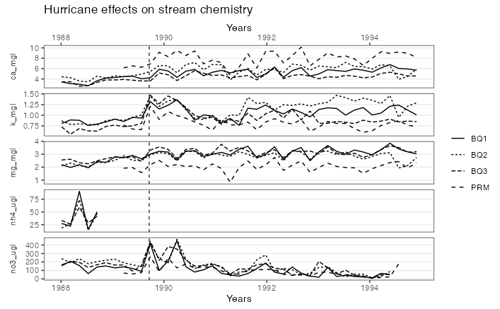

# Hurricane Disturbance and Stream Water Chemistry in Luquillo, Puerto Rico 

### Purpose of this Repository 

This repository aims to replicate an analysis done by Douglas. A. Schaefer
et al. titled *Effects of hurricane disturbance on stream water concentrations and fluxes in eight tropical forest watersheds of the Luquillo Experimental Forest, Puerto Rico.* The study was published by Cambridge University Press in 01 March 2000 and the authors analyzed the effects of hurricane disturbance on stream water concentrations and the variation in eight different tropical forest watersheds.

*Figure reproduced from Schaefer et al. (2000).*

### Package Dependencies

* `tidyverse` 

* `fs` 

The data files used for this analysis were downloaded from [EDI Data Portal](https://portal.edirepository.org/nis/mapbrowse?packageid=knb-lter-luq.20.4923064) and can be found in the folder `data`:

- QuebradaCuenca1-Bisley.csv
- QuebradaCuenca2-Bisley.csv
- QuebradaCuenca3-Bisley.csv
- RioMameyesPuenteRoto.csv

### Repository Contents

This repository houses multiple folders and files (scripts) that are necessary for replicating the analysis.

The [`data`](data/) folder contains all the raw data downloaded from EDI Data Portal. There is a .csv file for each of the three BQ watersheds and for the PRM watershed.

The [`docs`](docs/) folder contains the .html file used to create a webpage in GitHub Pages.

The [`images`](images/) folder contains two .png files of the original graph I replicated as well as the one I created.

The [`output`](output/) folder contains one .csv file, [`clean_data.csv`](output/clean_data.csv), that contains the 9-week moving average concentrations for each nutrient in each watershed that was studied.

The [`paper`](paper/) folder contains a Quarto markdown file that contains all of the analysis and resulting figure as a rendered output.

The [`R`](R/) folder contains [`moving-average.R`](R/moving-average.R) which is a file that defines the `moving_average()` function that is then used for the figure.

The `01_clean_data.R` script is cleaning and wrangling the data. This script acts as the intermediate connection that will populate the `output` folder with a .csv of the cleaned data from the analysis.  

The `scratch.R` file is where all of the pre-analysis and spaghetti code took place. This is a brief insight into my workflow and how I approached the final steps of the analysis. 

## Results

The below graph shows the concentrations of Ca, K, Mg, NH$_4$, and NO$_3$ in the BQ1, BQ2, BQ3, and PRM watersheds in Bisley, Puerto Rico. The vertical line indicates the time of Hurricane Hugo's disturbance on September 19th, 1989.

### Data and File Information 

**The Analysis** uses examples from the paper:

Schaefer, Douglas. A., William H. McDowell, Fredrick N. Scatena, and Clyde E. Asbury. 2000. “Effects of Hurricane Disturbance on Stream Water Concentrations and Fluxes in Eight Tropical Forest Watersheds of the Luquillo Experimental Forest, Puerto Rico.” *Journal of Tropical Ecology* 16 (2): 189–207. https://doi.org/10.1017/s0266467400001358.

**The Analysis** uses the dataset:

McDowell, William H., and USDA Forest Service. 2024. “Chemistry of Stream Water from the Luquillo Mountains.” International Institute of Tropical Forestry (IITF). Environmental Data Initiative. https://doi.org/10.6073/pasta/f31349bebdc304f758718f4798d25458.

*NOTE:* This data is in the raw form. Within this repository you can find which datasets were used for the analysis as well as the script to clean and bind the datasets. In turn, this makes the analysis easier to replicate. The raw data will be found in the data folder and the cleaned data in **(TBD)**. 

### Authors and Contributors

Author - [Ethan Mathews](https://github.com/ethan-mathews24) 

Contributor - [Max Czapanskiy](https://github.com/FlukeAndFeather)

Contributor - [Alessandra Vidal Meza](https://github.com/avidalmeza)