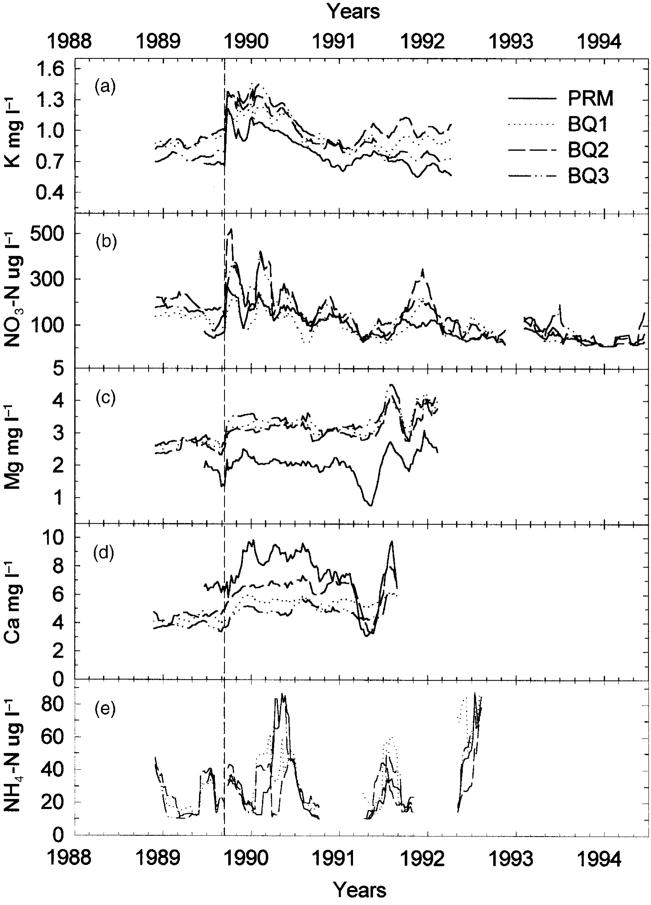

# Replicating an Analysis on Hurricane Disturbance and Stream Water Chemistry in Luquillo, Puerto Rico 


### Purpose of this Repository 

This repository aims to replicate an analysis done by Douglas. A. Schaefer
et al. titled *Effects of hurricane disturbance on stream water concentrations and fluxes in eight tropical forest watersheds of the Luquillo Experimental Forest, Puerto Rico.* The study was published by Cambridge University Press in 01 March 2000 and the authors analyzed the effects of hurricane disturbance on stream water concentrations and the variation in eight different tropical forest watersheds.




### Repository Contents

The repository contains the packages needed to run the analysis and load in data files, the raw data, R scripts to run the analysis, and the citations from where the analysis came from. 


### File Structure: 

```
TBD run fs::dir_tree() in the console and paste here.

```


### Package Dependencies

* `tidyverse` 

* `lubridate`

* `fs` 


### Data and File Information 

**The Analysis** uses examples from the paper:

Schaefer, Douglas. A., William H. McDowell, Fredrick N. Scatena, and Clyde E. Asbury. 2000. “Effects of Hurricane Disturbance on Stream Water Concentrations and Fluxes in Eight Tropical Forest Watersheds of the Luquillo Experimental Forest, Puerto Rico.” *Journal of Tropical Ecology* 16 (2): 189–207. https://doi.org/10.1017/s0266467400001358.

**The Analysis** uses the dataset:

McDowell, William H., and USDA Forest Service. 2024. “Chemistry of Stream Water from the Luquillo Mountains.” International Institute of Tropical Forestry (IITF). Environmental Data Initiative. https://doi.org/10.6073/pasta/f31349bebdc304f758718f4798d25458.

*NOTE:* This data is in the raw form. Within this repository you can find which datasets were used for the analysis as well as the script to clean and bind the datasets. In turn, this makes the analysis easier to replicate. The raw data will be found in the data folder and the cleaned data in **(TBD)**. 


### Authors and Contributors

Author - [Ethan Mathews](https://github.com/ethan-mathews24) 

Contributor - [Max Czapanskiy](https://github.com/FlukeAndFeather)

Contributor - [Ale Vida Meza](https://github.com/avidalmeza)